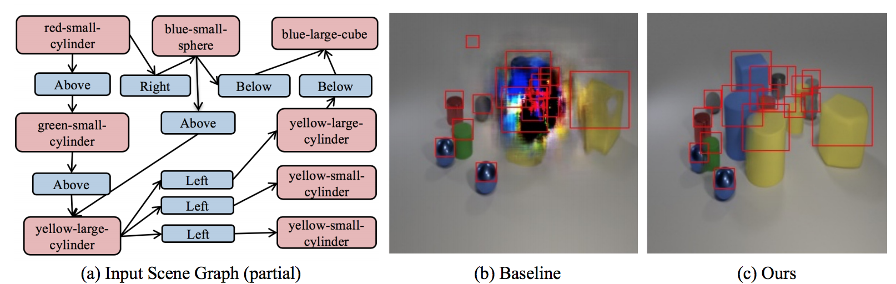

# CanonicalSg2Im

#### [Roei Herzig*](https://roeiherz.github.io/), [Amir Bar*](http://www.amirbar.net/), [Huijuan Xu](https://cs-people.bu.edu/hxu/), [Gal Chechik](https://chechiklab.biu.ac.il/), [Trevor Darrell](https://people.eecs.berkeley.edu/~trevor/), [Amir Globerson](https://www.cs.tau.ac.il/~gamir/)

Main project [page](https://roeiherz.github.io/CanonicalSg2Im/)

<!---[alt text](Figures/teaser.png)--->


Generation of scenes with many objects. Our method achieves better performance on such scenes than previous methods. Left: A partial input scene graph.
Middle: Generation using [1]. Right: Generation using our proposed method.


### Our novel contributions are:
1. We propose a model that uses canonical representations of SGs, thus obtaining stronger invariance properties. This in turn leads to **generalization on semantically equivalent graphs and improved robustness to graph size and noise** in comparison to existing methods.
2. We show how to learn the canonicalization process from data.
3. We use our canonical representations within an SG-to-image model and demonstrate our approach results in an **improved generation** on Visual Genome, COCO, and CLEVR, compared to the state-of-the-art baselines.


## Notes

**Please note that the main part of the code has been released, though we are still testing it to fix possible glitches. Thank you.**

This implementation is built on top of https://github.com/google/sg2im.


## References
[1] Justin Johnson, Agrim Gupta, Li Fei-Fei, [Image Generation from Scene Graphs](https://arxiv.org/abs/1804.01622), 2018.


## Citation

```
@inproceedings{goldman2019dense,
 author    = {Herzig, Roei and Bar, Amir and Xu, Huijuan and Chechik, Gal and Darrell, Trevor and Globerson, Amir},
 title     = {Learning Canonical Representations for Scene Graph to Image Generation},
 booktitle = {Proc. of the European Conf. on Computer Vision (ECCV)},
 year      = {2020}
}
```


Code and models will be released soon.
