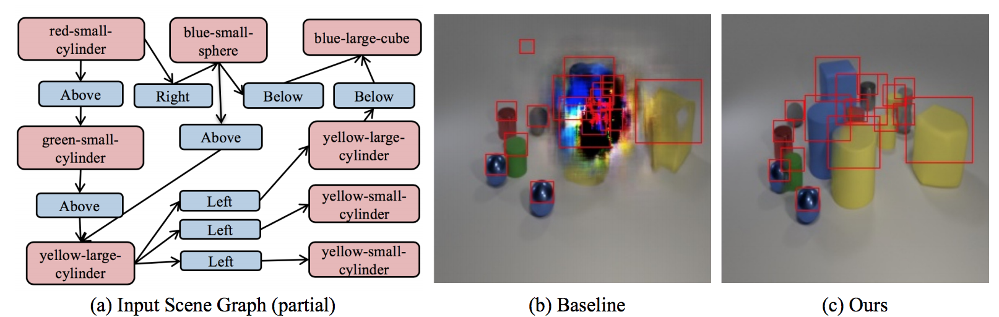

# Learning Canonical Representations for Scene Graph to Image Generation (ECCV 2020)

#### [Roei Herzig*](https://roeiherz.github.io/), [Amir Bar*](http://www.amirbar.net/), [Huijuan Xu](https://cs-people.bu.edu/hxu/), [Gal Chechik](https://chechiklab.biu.ac.il/), [Trevor Darrell](https://people.eecs.berkeley.edu/~trevor/), [Amir Globerson](https://www.cs.tau.ac.il/~gamir/)

Main project [page](https://roeiherz.github.io/CanonicalSg2Im/).


<!---[alt text](figures/teaser.png)--->


Generation of scenes with many objects. Our method achieves better performance on such scenes than previous methods. Left: A partial input scene graph.
Middle: Generation using [1]. Right: Generation using our proposed method.


### Our novel contributions are:
1. We propose a model that uses canonical representations of SGs, thus obtaining stronger invariance properties. This in turn leads to **generalization on semantically equivalent graphs and improved robustness to graph size and noise** in comparison to existing methods.
2. We show how to learn the canonicalization process from data.
3. We use our canonical representations within an SG-to-image model and demonstrate our approach results in an **improved generation** on Visual Genome, COCO, and CLEVR, compared to the state-of-the-art baselines.


<!--## Setup
To install the environment, following the instructions:
- `install` [conda3](https://repo.anaconda.com/miniconda/Miniconda3-latest-Linux-x86_64.sh)
- `conda create --name canonical`
- `conda activate canonincal`
- `conda install ipython`
- `pip install ninja yacs cython matplotlib tqdm opencv-python`
- `conda install pytorch torchvision cudatoolkit=10.0 -c pytorch`
- `pip install pillow tensorboardX pandas joblib`
- `pip install h5py imageio lmdb`
- `pip install scipy==1.3.3` -->


## Dependencies
To get started with the framework, install the following dependencies:
- [Python 3.7](https://www.python.org/)
- `pip install -r requirments.txt`

<!--To get started with the framework, install the following dependencies:
- [Python 3.7](https://www.python.org/)
- [Pytorch 1.1.0](https://www.https://pytorch.org/)
- [matplotlib 3.1.3](http://matplotlib.org/)
- [h5py 2.9.0](http://www.h5py.org/)
- [numpy 1.18.1](http://www.numpy.org/)
- [scipy 1.3.3]()
- [pandas 1.0.3]()
- [imageio 2.8.0]()
- [tensorboardX 1.8]()
- [opencv-python 4.2.9]()
- [joblib 0.14.1]()
- [lmdb 0.98]() -->

<!--Run `"pip install -r requirements.txt"`  - to install all the requirements.-->


## Data

Follow the commands below to build the data.

### COCO
`./scripts/download_coco.sh`

### VG
`./scripts/download_vg.sh`

### CLEVR
Please download the CLEVR-Dialog Dataset from [here](https://github.com/satwikkottur/clevr-dialog).


## Training
### Training a SG-to-Layout model:
```
python -m scripts.train --dataset={packed_coco, packed_vg, packed_clevr}  
```

### Training AttSpade - Layout-to-Image model:

Optional arguments:
```
--output_dir=output_path_dir/%s (s is the run_name param) --run_name=folder_name --checkpoint_every=N (default=5000) --dataroot=datasets_path --debug (a flag for debug)
```

Train on COCO (with boxes):
```
python -m scripts.train --dataset=coco --batch_size=16 --loader_num_workers=0 --skip_graph_model=0 --skip_generation=0 --image_size=256,256 --min_objects=1 --max_objects=1000 --gpu_ids=0 --use_cuda
```

Train on VG:
```
python -m scripts.train --dataset=vg --batch_size=16 --loader_num_workers=0 --skip_graph_model=0 --skip_generation=0 --image_size=256,256 --min_objects=3 --max_objects=30 --gpu_ids=0 --use_cuda
```

Train on CLEVR:
```
python -m scripts.train --dataset=packed_clevr --batch_size=6 --loader_num_workers=0 --skip_graph_model=0 --skip_generation=0 --image_size=256,256 --use_img_disc=1 --gpu_ids=0 --use_cuda
```

## Inference
### Inference SG-to-Layout
To produce layout outputs and IOU results, run:
```
python -m scripts.layout_generation --checkpoint=<trained_model_folder> --gpu_ids=<0/1/2>
```
A new folder with the results will be created in: `<trained_model_folder>`

##### Pre-trained Models:

COCO: [link](https://www.dropbox.com/sh/61u5ntg4v0fucid/AACxHFjqXrlVEow4OMnEI3tya?dl=0);
Visual Genome: [link](https://www.dropbox.com/s/6ai9y91ll3sd6rk/results_vg.csv?dl=0); 


### Inference Layout-to-Image (LostGANs)
Please use [LostGANs implementation](https://github.com/WillSuen/LostGANs)

### Inference Layout-to-Image (from dataframe)
To produce the image from a dataframe, run:
```
python -m scripts.generation_dataframe --checkpoint=<trained_model_folder>
```
A new folder with the results will be created in: `<trained_model_folder>`

### Inference Layout-to-Image (AttSPADE)
#### COCO/ Visual Genome
1. ##### Generate images from a layout (dataframe):
```
python -m scripts.generation_dataframe --gpu_ids=<0/1/2> --checkpoint=<model_path> --output_dir=<output_path> --data_frame=<dataframe_path> --mode=<gt/pred>
```

```mode=gt``` defines use gt_boxes while ```mode=pred``` use predicted box by our WSGC model from the paper (see the dataframe for more details).


##### Pre-trained Models:

###### COCO

dataframe: [link](https://www.dropbox.com/s/e1890f0i3vtihme/results_coco.csv?dl=0); 
128x128 resolution: [link](https://www.dropbox.com/sh/61u5ntg4v0fucid/AACxHFjqXrlVEow4OMnEI3tya?dl=0);
256x256 resolution: [link](https://www.dropbox.com/sh/c9vvc5hhwojbqdf/AADchhvJt_NW4gYaE6DoN-Eba?dl=0)


###### Visual Genome

dataframe: [link](https://www.dropbox.com/s/6ai9y91ll3sd6rk/results_vg.csv?dl=0); 
128x128 resolution: [link](https://www.dropbox.com/sh/e0bbpeql1584svl/AAAX9kGiHRIwXV-uD782I99na?dl=0); 
256x256 resolution: [link](https://www.dropbox.com/sh/19eky31f00ltqmz/AABYLquTPSqC6vC9J48oXTqNa?dl=0)


2. ##### Generate images from a scene graph:
```
python -m scripts.generation_attspade --gpu_ids=<0/1/2> --checkpoint=<model/path> --output_dir=<output_path>
```

#### CLEVR

This script generates CLEVR images on large scene graphs from ```scene_graphs.pkl```. It generates the CLEVR results for both WSGC + AttSPADE and Sg2Im + AttSPADE. For more information, please refer to the paper.

```
python -m scripts.generate_clevr --gpu_ids=<0/1/2> --layout_not_learned_checkpoint=<model_path> --layout_learned_checkpoint=<model_path> --output_dir=<output_path>
```

##### Pre-trained Models:

Baseline (Sg2Im): [link](https://www.dropbox.com/sh/ss48bynmg2p2vue/AAAXjAxc1RHEz2qj-GZh_3iXa?dl=0);
WSGC: [link](https://www.dropbox.com/sh/tt6ajappz9iaeya/AABs7aUq-nvSVKeztRsEg8YLa?dl=0)


## Acknowledgment
- This implementation is built on top of [1]: https://github.com/google/sg2im.


## References
[1] Justin Johnson, Agrim Gupta, Li Fei-Fei, [Image Generation from Scene Graphs](https://arxiv.org/abs/1804.01622), 2018.


## Citation

```
@inproceedings{herzig2019canonical,
 author    = {Herzig, Roei and Bar, Amir and Xu, Huijuan and Chechik, Gal and Darrell, Trevor and Globerson, Amir},
 title     = {Learning Canonical Representations for Scene Graph to Image Generation},
 booktitle = {Proc. of the European Conf. on Computer Vision (ECCV)},
 year      = {2020}
}
```


